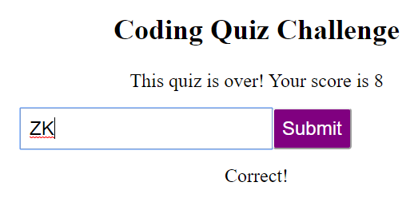

## Code Quiz

This application is a simple quiz game built in Javascript.  It updates the HTML and CSS dynamically using DOM manipulation to guide users through a simple quiz.  There is a dynamic timer and high scores are saved in local storage.

## Screenshots

The Starting Page

A Typical Question

High Score Entry

The High Score Screen

